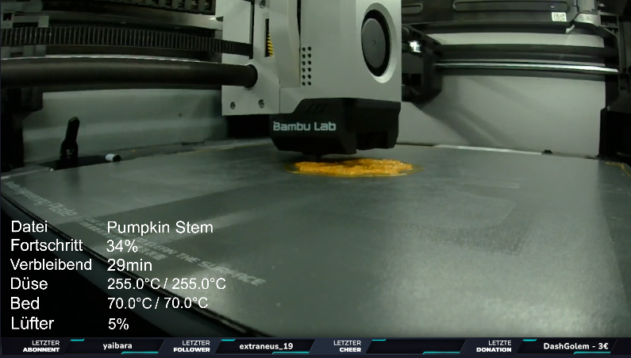

# BambuOBS
Python script to get all the print data of your Balbulab printer and showing it in OBS with textfiles.
The Script connects to the local MQTT broker of the printer and subscribes to the printer states topic.  

The script will write all files into the **overlays** folder

Change the **IP-Address** and the **Accesscode**
You can add more Keys and their suffixes in the **key_suffixes** map

